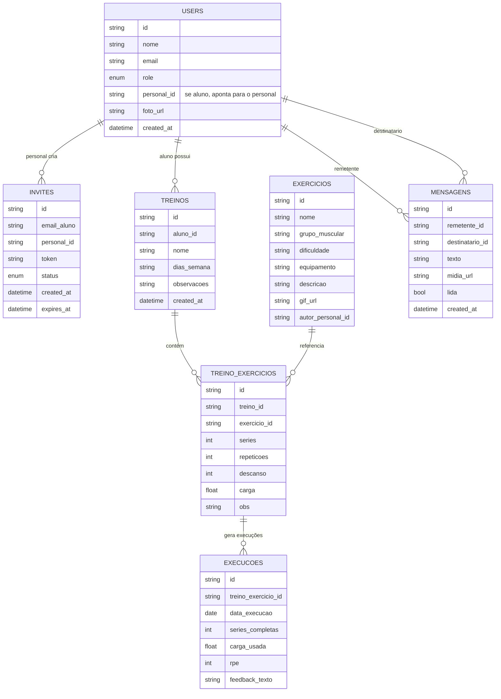

# Arquitetura Funcional – Personal & Aluno (v1.0-ultra)

Meta
- Autor: Lucas
- Stack: Next.js (T3), tRPC, Prisma, Tailwind, Supabase (Auth/DB/Storage/Realtime), Vercel (Deploy/PWA), GitHub (CI/CD)
- Objetivo: Sistema comercial completo para relação personal ↔ aluno com convite seguro, acompanhamento de treinos, chat, notificações e modo offline.

Resumo Executivo
- App Router (Next.js) como base de UI e navegação.
- tRPC para contrato de API typesafe (mantendo DX do T3).
- Supabase como backend: Auth (convite/ativação), Postgres + RLS (controle de acesso por papel e vínculo), Storage (mídias), Realtime (chat/notificações).
- PWA com cache inteligente, fila de operações offline (outbox), reconciliação idempotente.
- Observabilidade: Sentry (erro), Vercel Analytics, Supabase logs. Alertas de segurança e métricas de produto.

Papéis
- Personal: cria convites, gerencia alunos, treinos, exercícios, acompanha execuções, conversa (chat) e envia notificações.
- Aluno: executa treino do dia, envia feedbacks (texto/RPE), acompanha progresso, conversa (chat).
- Restrição: aluno só entra via convite; não cria biblioteca; não convida terceiros; acessos fortemente resguardados por RLS.

Entidades e Relacionamentos (conceitual)
- Users: {id, nome, email, role(personal|aluno), personal_id, foto_url, created_at}
- Invites: {id, email_aluno, personal_id, token, status(pending|accepted|revoked|expired), created_at, expires_at}
- Exercicios: {id, nome, grupo_muscular, dificuldade, equipamento, descricao, gif_url, autor_personal_id}
- Treinos: {id, aluno_id, nome, dias_semana, observacoes, created_at}
- TreinoExercicios: {id, treino_id, exercicio_id, series, repeticoes, descanso, carga, obs}
- Execucoes: {id, treino_exercicio_id, data_execucao, series_completas, carga_usada, rpe, feedback_texto}
- Mensagens: {id, remetente_id, destinatario_id, texto, midia_url, lida, created_at}

Diagrama ER (Mermaid)

Fluxos Principais
- Convite → Ativação → Sincronização: ver “Fluxo-Convite-Ativacao-Sincronizacao.md”. Em alto nível:
  1) Personal cria convite (email do aluno) → token único, TTL, single-use.
  2) E-mail com link assinado → aluno clica → validação → criação/associação do usuário (role=aluno, personal_id).
  3) Sincronização inicial: treino do dia, biblioteca e estado do chat; pré-carregar caches PWA.
- Execução de treino:
  - Aluno navega por passos (series/repetições); captura RPE/feedback; logs são enfileirados offline se necessário e reconciliados quando online.
- Chat:
  - Canal bidirecional, com Supabase Realtime. Notificações push quando novas mensagens/treinos.

Arquitetura Técnica (alto nível)
- Frontend (Next.js App Router):
  - UI com Tailwind + shadcn/ui; tema escuro com cores neon (ver DesignSystem).
  - PWA: manifest, service worker próprio; cache “app shell” + dados dinâmicos com estratégia Stale-While-Revalidate; fila offline (IndexedDB).
- API (tRPC):
  - Procedimentos expõem operações de negócio (convite, treinos, execuções, chat).
  - Middlewares validam role e vínculo aluno→personal.
- Backend (Supabase):
  - Auth: fluxo de convite; custom claims para role; de/para Next.js via supabase-js.
  - Postgres: tabelas do domínio; RLS pervasivo (ver políticas abaixo).
  - Storage: bucket “exercicios-media”; ACL via policies.
  - Realtime: canais para mensagens e eventos (novos treinos, inatividade).
- Observabilidade:
  - Sentry (erro JS/TS + performance), Vercel Analytics, Supabase logs (Postgres/Edge).
  - Alertas: webhook para incidentes (Supabase row-based logs ou Logflare).
- Segurança:
  - Tokens de convite: single-use, TTL (ex.: 72h), revogáveis.
  - RLS: 
    - aluno só lê/edita seus dados, treinos e execuções vinculados (aluno_id).
    - personal só lê/edita recursos de seus alunos (personal_id); biblioteca autoral por autor_personal_id.
    - mensagens visíveis somente a remetente/destinatário.
  - Uploads: validação de MIME e tamanho; varredura simples (server-side) se necessário.
- Performance:
  - Preload de dados críticos; incremental revalidation de páginas; compressão e lazy-loading de mídia.
  - Timers e animações leves (GPU-friendly); evitar layout shift.

Offline, Cache e Reconciliação
- IndexedDB (Dexie/localforage) para “outbox”: gravações de execuções, mensagens, feedbacks.
- Strategy:
  - Cada operação recebe um “idempotency_key”.
  - No retorno online, o worker reenvia o outbox em ordem; servidor aplica idempotência (sem duplicar).
  - Conflito: última escrita vence com merge orientado por servidor; cliente atualiza difs via Realtime.
- Cache:
  - App shell + assets estáticos.
  - Dados dinâmicos com SWR e rotas de fallback offline (ex.: treino do dia).
- KPIs de sincronização: latência média de reconciliação, falhas por operação, tempo de fila.

Matriz de Papéis e Acessos
- Ver “Roles-Matriz.md”.

Integrações GitHub ↔ Vercel ↔ Supabase
- GitHub: repositório conectado ao Vercel; GitHub Actions para lint, test, build.
- Vercel: preview por PR; envs (preview/prod) com variáveis seguras; Analytics e Edge Functions quando aplicável.
- Supabase: projeto com db + storage; policies RLS; chaves segregadas (anon vs service role).

KPIs do Produto
- Adoção: ≥90% convites aceitos.
- Offline: 100% reconciliação sem perdas; cobertura de navegação-chave offline.
- Performance: TTI ≤ 2.5s (mobile), Lighthouse ≥ 90.
- Engajamento: ≥75% alunos enviando feedbacks semanais.

Critérios de Aceite (PLAN)
- Todos fluxos descritos e diagramados.
- Documentos entregues: Arquitetura-Funcional.md, Fluxo-Convite-Ativacao-Sincronizacao.md, CI-CD.md, Roles-Matriz.md, Ops-Env.md.
- Integração de ambiente planejada e checklist pronta.