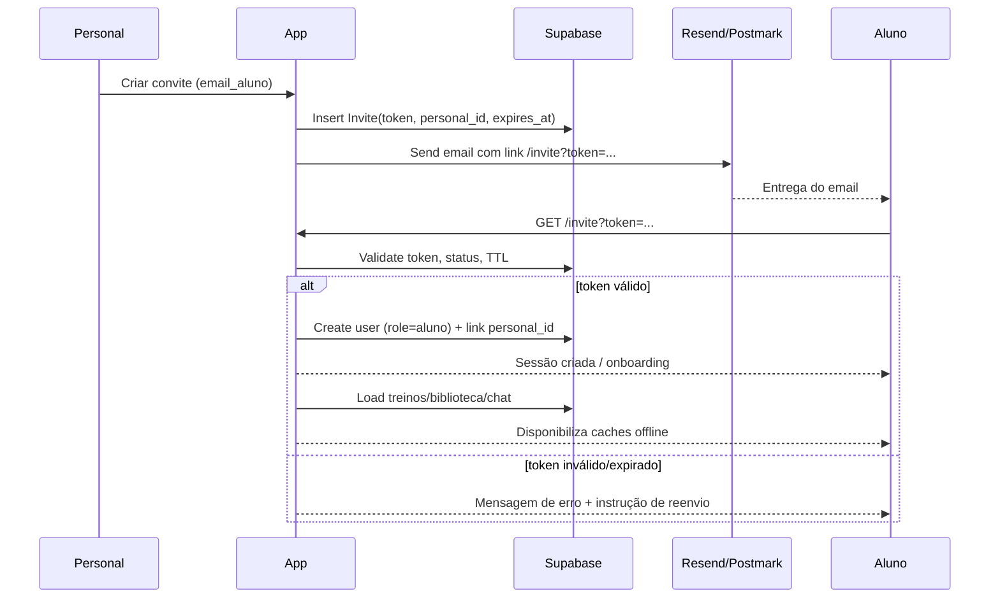

# Fluxo de Convite → Ativação → Sincronização

Objetivo
- Permitir onboarding seguro do aluno sem criação livre de conta: somente via convite emitido pelo personal.

Visão Geral
- Token único, uso único (single-use), TTL configurável (ex.: 72h).
- Vínculo aluno→personal estabelecido no momento da ativação.
- Pré-carregamento de caches offline após ativação.

Flowchart (Mermaid)
```mermaid
flowchart TD
    P[Personal inicia convite] --> C[Preenche email do aluno]
    C --> T[Gera token com TTL e single-use]
    T --> E[Envio de e-mail (Resend/Postmark) com link assinado]
    E --> A[Aluno clica no link]
    A --> V[Validação do token, status e expiração]
    V -- válido --> S[Criação/associação de usuário (role=aluno, personal_id do emissor)]
    S --> R[Setup inicial: foto/nome opcional, aceitar termos]
    R --> D[Sincronização inicial (treinos, biblioteca, chat)]
    D --> O[PWA: cache app shell + dados críticos]
    V -- inválido/expirado --> X[Erro e oferta de reenvio]
    X --> RE[Personal reenvia convite ou revoga]
```

Sequência (Mermaid)


Detalhes de Segurança
- Token aleatório, 32+ bytes, guardado com hash no banco; comparação por hash.
- TTL: expires_at; job de limpeza opcional (revogar pendentes vencidos).
- Single-use: status transita para “accepted” no primeiro uso; bloqueio de reutilização.
- Rate-limit por emissor; logs de audit trail (quem convidou, quando, para quem).

Sincronização Inicial (após ativação)
- Treinos do aluno (ativos) + treino do dia.
- Biblioteca de exercícios (global + do personal).
- Estado do chat (conversas recentes com o personal).
- Pré-cache:
  - App shell, UI estática, iconografia.
  - Dados críticos (mínimos) para arrancar offline.
- Indexação local:
  - IndexedDB: perfis, treinos, mensagens recentes.
  - Outbox configurado para operações de gravação (execuções/feedback/mensagens).

Casos de Borda
- Token reusado: negar, solicitar novo convite.
- Email em uso: se já houver conta aluno vinculada a outro personal, bloquear e exibir suporte.
- Reenvio: criando novo token invalida o anterior (status=revoked).
- Convite para domínio corporativo: verificar política de email (ex.: bloqueio de “no-reply”).

KPIs do Fluxo
- Taxa de aceite de convites ≥ 90%.
- Tempo médio de ativação (email → clique → conta).
- Falhas por causa (token expirado, email incorreto, entrega de email).
- Latência de primeira sincronização ≤ 2s (após sessão criada).